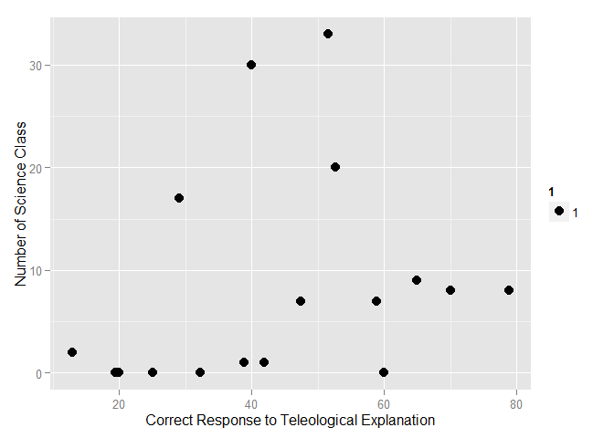
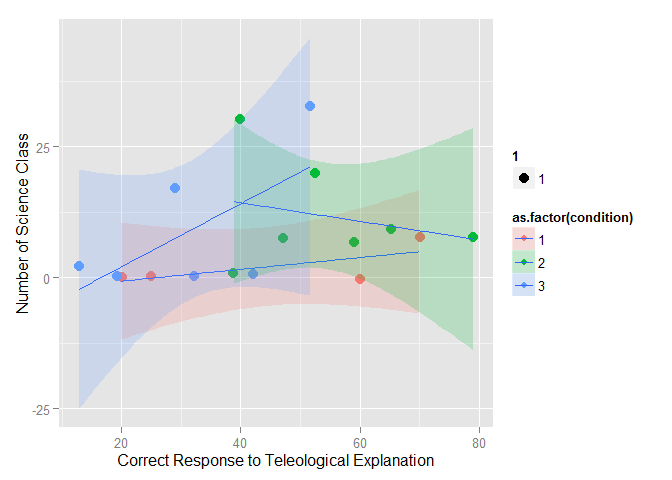
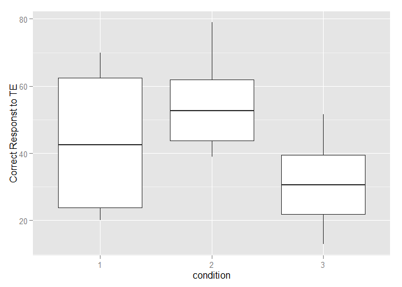

# Ggplot_Example

1.ggplot2 packages

```r
library(ggplot2)
```

Read data

```r
Replicate <- read.csv("C:/Users/Yoo/Desktop/forR.csv", header=T)
```

Scatter Plot

```r
scatter<-ggplot(Replicate,aes(dv,classnum))
scatter+geom_point(aes(size=1))+labs(x="Correct Response to Teleological Explanation",y="Number of Science Class")
```

 

Scatter Plot with Smooth Line

```r
scatter+geom_point(aes(size=1))+geom_smooth(method='lm',aes(fill=as.factor(condition)),alpha=0.2)+labs(x="Correct Response to Teleological Explanation",y="Number of Science Class")
```

 

Correlation Coefficient

```r
cor.test(Replicate$dv, Replicate$classnum, method= "pearson")
```

```
## 
## 	Pearson's product-moment correlation
## 
## data:  Replicate$dv and Replicate$classnum
## t = 1.0122, df = 15, p-value = 0.3275
## alternative hypothesis: true correlation is not equal to 0
## 95 percent confidence interval:
##  -0.2593038  0.6540151
## sample estimates:
##      cor 
## 0.252855
```

Boxplot

```r
Boxplot <- ggplot(Replicate, aes(as.factor(condition), dv))
Boxplot+geom_boxplot() +labs(x="condition",y="Correct Responst to TE")
```

 

